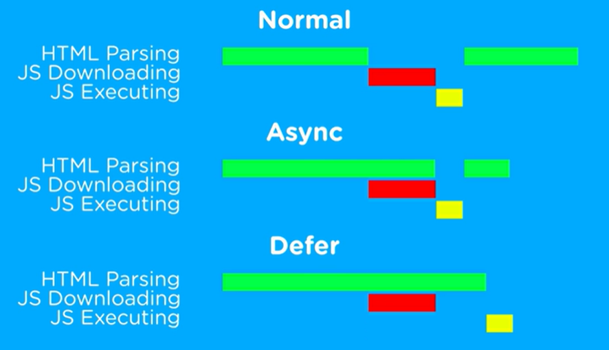

___
>DOM NOTES
* Always use defer
* Probably not ever use async 
* Try to avoid Normal Loading Unless you put it at the end of the body
  
<br>  <br>
___

>Window is an Object
```javascript
console.log(window);

Both are same : as window is globle object
alart("Hello world");
window.alart("Hello World")
```
>Document Object is HTML page
```
              html = root node
              /              \
            head            body
            /              /    \
          title           h1      p
            
              *document obj*
```
  


